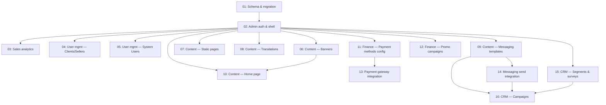

# Admin Back-Office

## Overview

A new `/admin` back office for internal staff, gated by a new `UserRole.ADMIN` on top of the existing Better Auth setup. It covers five sections: Sales Analytics (date-ranged turnover/revenue/order-status reporting with Excel export), Content Management (banners, static pages, translations, messaging templates, home page composition), Finances (payment method toggles, promo campaigns), User Management (Clients, Sellers = drivers + logistics companies, and System Users = the admin staff themselves), and a scoped-down CRM (segments, surveys, campaigns). Two sub-areas — real payment-gateway processing and real email/SMS sending — are placed in their own later wave because they depend on provider choices the user hasn't made yet (see `action-required.md`).

## Quick Links

- [Requirements](./requirements.md) — full requirements, goals/non-goals, assumptions
- [Action Required](./action-required.md) — manual steps needing human action (provider decisions, account setup, seeding)

## Dependency Graph

## Waves

| Wave | Tasks | Description |
|------|-------|-------------|
| 1 | task-01 | Foundation: every new Prisma model/enum in one migration, so nothing downstream edits `schema.prisma` concurrently. |
| 2 | task-02 | Foundation: admin auth guard, sign-in, a new `admin.` subdomain (mirroring the existing merchant/client host split via a new `NEXT_PUBLIC_ADMIN_HOST` var), the full nav/shell/section-tab layouts, and closing the `role: "ADMIN"` self-sign-up gap. |
| 3 | task-03, task-04, task-05 | Sales Analytics + User Management (Clients/Sellers, System Users) — the highest-value, least-blocked sections. |
| 4 | task-06, task-07, task-08, task-09, task-10, task-11, task-12 | Content Management (banners, static pages, translations, messaging-template content, home page) + Finances (payment method toggles, promo campaigns). |
| 5 | task-13, task-14 | Payment gateway integration and messaging send integration — both blocked on provider decisions (see `action-required.md`); build only once a provider is confirmed. |
| 6 | task-15, task-16 | CRM (segments, surveys, campaigns) — the most speculative section, sequenced last per the user's explicit phasing request. |

## Task Status

### Wave 1
- [x] [task-01-schema-and-migration](./tasks/task-01-schema-and-migration.md) — Admin back-office schema and migration

### Wave 2
- [ ] [task-02-admin-auth-and-shell](./tasks/task-02-admin-auth-and-shell.md) — Admin auth guard, sign-in, and back-office shell

### Wave 3
- [ ] [task-03-sales-analytics-dashboard](./tasks/task-03-sales-analytics-dashboard.md) — Sales analytics dashboard + Excel export
- [ ] [task-04-user-management-clients-sellers](./tasks/task-04-user-management-clients-sellers.md) — User management — Clients and Sellers
- [ ] [task-05-user-management-system-users](./tasks/task-05-user-management-system-users.md) — User management — System Users

### Wave 4
- [ ] [task-06-content-banners](./tasks/task-06-content-banners.md) — Content management — Banners
- [ ] [task-07-content-static-pages](./tasks/task-07-content-static-pages.md) — Content management — Static pages
- [ ] [task-08-content-translations](./tasks/task-08-content-translations.md) — Content management — Translations
- [ ] [task-09-content-messaging-templates](./tasks/task-09-content-messaging-templates.md) — Content management — Messaging templates (content only)
- [ ] [task-10-content-homepage](./tasks/task-10-content-homepage.md) — Content management — Home page composition
- [ ] [task-11-finance-payment-methods-config](./tasks/task-11-finance-payment-methods-config.md) — Finances — Payment methods configuration
- [ ] [task-12-finance-promo-campaigns](./tasks/task-12-finance-promo-campaigns.md) — Finances — Promo campaigns (discount codes)

### Wave 5
- [ ] [task-13-payment-gateway-integration](./tasks/task-13-payment-gateway-integration.md) — Payment gateway integration ⚠ blocked on provider decision
- [ ] [task-14-messaging-send-integration](./tasks/task-14-messaging-send-integration.md) — Messaging send integration ⚠ blocked on provider decision

### Wave 6
- [ ] [task-15-crm-segments-and-surveys](./tasks/task-15-crm-segments-and-surveys.md) — CRM — Segments and surveys
- [ ] [task-16-crm-campaigns](./tasks/task-16-crm-campaigns.md) — CRM — Campaigns
