# Business Fleet Onboarding

## Overview

A self-serve registration wizard that takes a logistics company from account creation to a dispatchable fleet: company and authorisation details, fleet composition by cargo body type and vehicle class, a specification per vehicle, a named driver behind every one, and a submit step — followed by an admin review queue that verifies the company once and clears or flags each vehicle individually. Based on the approved design in `UI:UX/Business Fleet Onboard/design_handoff_business_onboarding/`. Replaces nothing directly, but it fills two holes at once: a `LogisticsCompany` today is a six-field profile with no address, payout account or review lifecycle, created only by an internal admin — and the COMPANY role has had no sign-up or sign-in card on any host since `002d46a`/`65203b1`, leaving the entire `company-ops-dashboard` feature unreachable. This feature is the company-account counterpart to `specs/driver-vehicle-onboarding` and shares its vehicle taxonomy, body types, colour list, city list and review/flag/resubmit pattern.

## Quick Links

- [Requirements](./requirements.md) — full requirements, decisions, and acceptance criteria
- [Action Required](./action-required.md) — manual steps needing human action

## Dependency Graph

```mermaid
graph TD
    task-01-schema["01: Schema Migration"]
    task-02-trailer-spec["02: Trailer VehicleTypeSpec Seed"]
    task-03-model-data["03: Model Reference Data"]

    task-04-taxonomy["04: Vehicle Class Taxonomy — 5 Classes"]
    task-05-draft-api["05: Fleet Draft API"]
    task-06-company-api["06: Company Details API"]
    task-07-driver-api["07: Fleet Driver Create & Assign API"]
    task-08-entry["08: Company Account Entry"]

    task-09-shell["09: Fleet Wizard Shell"]

    task-10-step1["10: Step 1 — Company Details"]
    task-11-step2["11: Step 2 — Fleet Composition"]
    task-12-step3["12: Step 3 — Vehicle Specifications"]
    task-13-step4["13: Step 4 — Drivers & Assignment"]
    task-14-step5["14: Step 5 — Review & Submit"]
    task-15-status["15: Application Status Screen"]

    task-16-admin-nav["16: Admin Nav Registration"]
    task-17-admin-read["17: Admin Read APIs"]
    task-18-admin-mutate["18: Admin Mutation APIs"]

    task-19-admin-queue["19: Admin Queue Page"]
    task-20-admin-drawer["20: Admin Detail Drawer"]

    task-21-gate["21: Dispatch Gate & Redirect Wiring"]

    task-01-schema --> task-04-taxonomy
    task-02-trailer-spec --> task-04-taxonomy
    task-01-schema --> task-05-draft-api
    task-01-schema --> task-06-company-api
    task-01-schema --> task-07-driver-api
    task-01-schema --> task-08-entry
    task-01-schema --> task-16-admin-nav
    task-01-schema --> task-17-admin-read
    task-01-schema --> task-18-admin-mutate

    task-05-draft-api --> task-09-shell

    task-09-shell --> task-10-step1
    task-06-company-api --> task-10-step1
    task-09-shell --> task-11-step2
    task-04-taxonomy --> task-11-step2
    task-09-shell --> task-12-step3
    task-04-taxonomy --> task-12-step3
    task-03-model-data --> task-12-step3
    task-09-shell --> task-13-step4
    task-04-taxonomy --> task-13-step4
    task-07-driver-api --> task-13-step4
    task-09-shell --> task-14-step5
    task-04-taxonomy --> task-14-step5
    task-09-shell --> task-15-status
    task-10-step1 --> task-15-status
    task-12-step3 --> task-15-status
    task-14-step5 --> task-15-status

    task-16-admin-nav --> task-19-admin-queue
    task-17-admin-read --> task-19-admin-queue
    task-16-admin-nav --> task-20-admin-drawer
    task-17-admin-read --> task-20-admin-drawer
    task-18-admin-mutate --> task-20-admin-drawer

    task-08-entry --> task-21-gate
    task-14-step5 --> task-21-gate
    task-15-status --> task-21-gate
    task-18-admin-mutate --> task-21-gate
```

## Waves

| Wave | Tasks | Description |
|------|-------|--------------|
| 1 | task-01, task-02, task-03 | Schema migration (company fields, cities array, vehicle class column, application models, assignment exclusivity indexes), the new `TRAILER_TRUCK` spec seed, and the make/model reference data module. No shared files. |
| 2 | task-04 – task-08 | The five-class taxonomy shared with the driver flow, the resumable draft API, the company details API, the fleet driver create-and-assign API with licence capture and category gating, and the restored company sign-up/sign-in entry. All depend only on wave 1. |
| 3 | task-09 | The wizard's route, guard, step rail with live fleet tally, progress bar, draft-state context, toast and per-step stubs — sized narrow so wave 4 runs fully parallel against it. |
| 4 | task-10 – task-15 | The six company-facing screens (five wizard steps plus the application status screen), each filling one stub from task-09. task-14 additionally owns the submit endpoint. task-10 – task-14 run in parallel; **task-15 lands after task-10, task-12 and task-14 within this wave** — its two Fix dialogs mount task-10's `CompanyDetailsForm` and task-12's `VehicleEditorDialog`, and it calls the two endpoints task-14 owns. |
| 5 | task-16, task-17, task-18 | Admin nav registration, the read APIs (queue list + application detail), and the mutation APIs (verify/flag company, approve/flag vehicle, request changes, activate fleet) — independent of the wizard. |
| 6 | task-19, task-20 | The admin queue page and the 560px detail drawer, built against wave 5's APIs. |
| 7 | task-21 | The dispatch/activation gate and the `/dashboard` redirect that sends a company into the wizard, the status screen, or neither. |

## Task Status

### Wave 1
- [ ] [task-01-schema-migration](./tasks/task-01-schema-migration.md) — Company fields, cities array, `Vehicle.vehicleClass`, application models, assignment exclusivity indexes
- [ ] [task-02-trailer-vehicle-type-spec](./tasks/task-02-trailer-vehicle-type-spec.md) — Seed the one new `TRAILER_TRUCK` spec and its pricing rule
- [ ] [task-03-model-reference-data](./tasks/task-03-model-reference-data.md) — 31 make/model rows and the body-type adjustment function

### Wave 2
- [ ] [task-04-vehicle-class-taxonomy](./tasks/task-04-vehicle-class-taxonomy.md) — Grow the shared taxonomy to five classes; Heavy moves CE→C, Trailer added at CE
- [ ] [task-05-fleet-draft-api](./tasks/task-05-fleet-draft-api.md) — `GET`/`PATCH` resumable draft + `POST` reset
- [ ] [task-06-company-details-api](./tasks/task-06-company-details-api.md) — Company legal entity, contact and payout details
- [ ] [task-07-fleet-driver-api](./tasks/task-07-fleet-driver-api.md) — Roster list, create-with-licence, assign/unassign with category gating
- [ ] [task-08-company-account-entry](./tasks/task-08-company-account-entry.md) — Restore company sign-up and sign-in; Business becomes a company account

### Wave 3
- [ ] [task-09-fleet-wizard-shell](./tasks/task-09-fleet-wizard-shell.md) — Route, guard, step rail with fleet tally, progress bar, draft context, toast, step stubs

### Wave 4
- [ ] [task-10-step1-company-details](./tasks/task-10-step1-company-details.md) — Phone, legal entity, cities multi-select, contact person, payout IBAN
- [ ] [task-11-step2-fleet-composition](./tasks/task-11-step2-fleet-composition.md) — Three body panels with per-class steppers, locked cells, subtotals and grand total
- [ ] [task-12-step3-vehicle-specifications](./tasks/task-12-step3-vehicle-specifications.md) — Generated vehicle table + 640px editor with model prefill
- [ ] [task-13-step4-drivers-assignment](./tasks/task-13-step4-drivers-assignment.md) — Per-vehicle driver assignment: roster pick or create account
- [ ] [task-14-step5-review-submit](./tasks/task-14-step5-review-submit.md) — Four summary cards + `POST submit` with server-authoritative validation
- [ ] [task-15-application-status-screen](./tasks/task-15-application-status-screen.md) — Pending / action-required / approved with per-vehicle verdicts

### Wave 5
- [ ] [task-16-admin-nav-registration](./tasks/task-16-admin-nav-registration.md) — Register the business applications admin section
- [ ] [task-17-admin-applications-read-api](./tasks/task-17-admin-applications-read-api.md) — Queue list + application detail endpoints
- [ ] [task-18-admin-applications-mutation-api](./tasks/task-18-admin-applications-mutation-api.md) — Company verdict, per-vehicle verdict, request changes, activate fleet

### Wave 6
- [ ] [task-19-admin-business-queue-page](./tasks/task-19-admin-business-queue-page.md) — Filterable business applications table
- [ ] [task-20-admin-business-detail-drawer](./tasks/task-20-admin-business-detail-drawer.md) — 560px drawer: company block, per-vehicle cards, reason chips, activate

### Wave 7
- [ ] [task-21-dispatch-gate-and-redirect](./tasks/task-21-dispatch-gate-and-redirect.md) — Activation gate on dispatch + `/dashboard` routing into wizard or status
