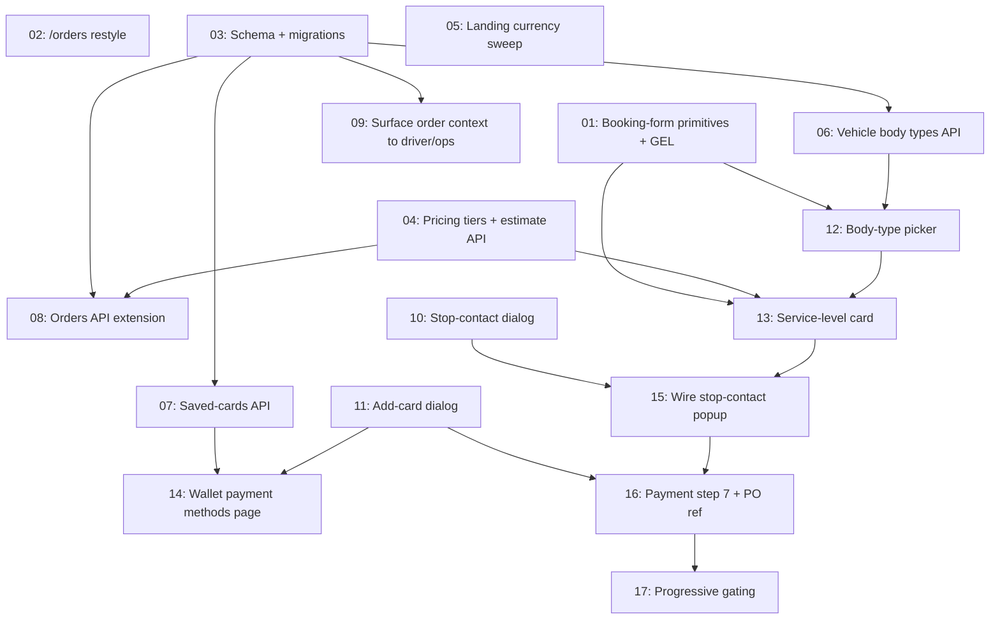

# Client Dashboard — Booking & Payment

## Overview

Implements the client-facing dashboard for both Individual and Business clients, from the design handoff at `UI:UX/Client Dashboard/design_handoff_booking_delivery_info/`. Six additions to the booking flow (delivery-info popup per stop, service levels, load-space body type, progressive gating, a payment step, and a Business-only PO/cost-centre reference), a restyle of `/orders` onto the booking page's visual language, and a rebuild of `/wallet` from placeholder into a Payment methods page.

`/account` (My account) is explicitly out of scope and must not be touched.

The handoff was written against commit `4d89213`. Commit `e7a7441` landed after it and already shipped the helper-count work — differently, and better. Handoff §5 and server-change §3 are therefore **already done** and must not be re-implemented; doing so would regress a working native-radio crew picker into a checkbox plus `aria-pressed` buttons. See [requirements.md](./requirements.md) §Assumptions.

## Quick Links

- [Requirements](./requirements.md) — full requirements, decisions and acceptance criteria
- [Action Required](./action-required.md) — manual steps needing human action
- Source handoff: `UI:UX/Client Dashboard/design_handoff_booking_delivery_info/README.md`

## Dependency Graph

## Waves

| Wave | Tasks | Description |
|------|-------|-------------|
| 1 | task-01, task-02, task-03, task-04, task-05 | Foundations. The enabling refactor of `booking-form.tsx` (which every later wave edits), the `/orders` restyle, all schema + migrations, the pricing tier maths, and the landing currency fix. No file overlap. |
| 2 | task-06, task-07, task-08, task-09 | Server layer on top of the new schema: body types on the vehicle taxonomy, saved-card CRUD, the order-create extension, and surfacing the new order context to drivers and ops. |
| 3 | task-10, task-11, task-12 | Two standalone dialog components (unwired) in parallel with the first `booking-form.tsx` feature edit. |
| 4 | task-13, task-14 | Service-level card in the booking form, and the wallet rebuild. |
| 5 | task-15 | Wire the stop-contact popup into the Route step. |
| 6 | task-16 | Payment step 7 and the Business PO/cost-centre field. |
| 7 | task-17 | Progressive gating — last, because it reads every other step's completion predicate. |

**Waves 3–7 are serialised on `src/components/home/booking-form.tsx`.** That file is ~1,445 lines and eight features modify it. Only one task per wave may edit it. Do not parallelise inside it.

## Task Status

### Wave 1
- [x] [task-01-booking-form-primitives](./tasks/task-01-booking-form-primitives.md) — Extract shared primitives, add `StepCard` disabled prop, switch booking form to GEL
- [x] [task-02-orders-restyle](./tasks/task-02-orders-restyle.md) — Restyle `/orders` and `OrderCard` onto the landing token set
- [x] [task-03-schema-and-migrations](./tasks/task-03-schema-and-migrations.md) — Stop contacts, service level, body type, saved cards, PO reference
- [x] [task-04-pricing-tiers](./tasks/task-04-pricing-tiers.md) — Priority/Pooling maths and a three-price estimate response
- [x] [task-05-landing-currency](./tasks/task-05-landing-currency.md) — Replace `$` with `₾` on the landing funnel

### Wave 2
- [ ] [task-06-vehicle-body-types](./tasks/task-06-vehicle-body-types.md) — Expose `bodyTypes` through the vehicle-types API
- [ ] [task-07-saved-cards-api](./tasks/task-07-saved-cards-api.md) — Saved-card list/create/default/delete routes
- [ ] [task-08-orders-api](./tasks/task-08-orders-api.md) — Accept and re-derive the new order fields
- [ ] [task-09-driver-ops-context](./tasks/task-09-driver-ops-context.md) — Show stop contacts, service level, body type and PO ref to drivers

### Wave 3
- [ ] [task-10-stop-contact-dialog](./tasks/task-10-stop-contact-dialog.md) — Delivery-info dialog component
- [ ] [task-11-add-card-dialog](./tasks/task-11-add-card-dialog.md) — Add-card dialog component (no PAN leaves the browser)
- [ ] [task-12-body-type-picker](./tasks/task-12-body-type-picker.md) — Load-space picker and vehicle filter in step 5

### Wave 4
- [ ] [task-13-service-level-card](./tasks/task-13-service-level-card.md) — Service level card, breakdown lines, bottom bar
- [ ] [task-14-wallet-page](./tasks/task-14-wallet-page.md) — `/wallet` becomes Payment methods

### Wave 5
- [ ] [task-15-wire-stop-contacts](./tasks/task-15-wire-stop-contacts.md) — Open the popup on address selection

### Wave 6
- [ ] [task-16-payment-step](./tasks/task-16-payment-step.md) — Step 7 payment method + Business PO reference

### Wave 7
- [ ] [task-17-progressive-gating](./tasks/task-17-progressive-gating.md) — Disable each step until the one before is answered

## Deferred cleanup

Raised by the Wave 1 review, non-blocking, to be applied after Wave 2 lands (both touch files Wave 2 agents are reading):

- [ ] **`@@index([savedCardId])` on `Order`** (`prisma/schema.prisma`) — `onDelete: SetNull` makes Postgres scan `Order` for referencing rows on every card deletion, which is exactly what task-07 builds, and task-16 queries orders by card. Needs a **new** migration; do not hand-edit `20260903051048_client_dashboard_booking/migration.sql`, which is already applied.
- [ ] **Alias `ServiceLevelKey` to the generated enum** (`src/lib/pricing.ts`) — it is currently a hand-written union `"PRIORITY" | "REGULAR" | "POOLING"` sitting alongside the real `ServiceLevel` enum that task-03 created. They can drift silently: adding a fourth tier to the schema would not fail typecheck. Replace with `import type { ServiceLevel } from "@prisma/client"; export type ServiceLevelKey = ServiceLevel;`

Two untracked scratch files sit in the tree and are **not** ours to remove — `hub-seed-inspect.mjs` (source of the four standing lint warnings) and `.tmp-list-users.mjs`. There is also a pre-existing `stash@{0}` ("task-09 partial start: reporting.ts + exceljs dep") that predates this feature.
