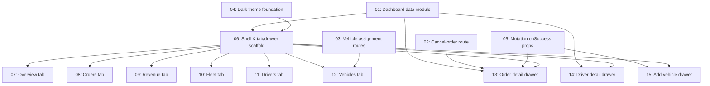

# Company Ops Dashboard

## Overview

Replaces `src/components/dashboard/company-dashboard.tsx` — currently a simple light-themed page listing a company's fleet, roster and open bookings — with a tabbed, dark "ops console" dashboard (Overview / Orders / Revenue / Fleet / Drivers / Vehicles), an order-detail drawer, a driver-detail drawer, an add-vehicle drawer, and toast notifications. Renders at the same `/dashboard` route for role `COMPANY`; no other route changes. Every number on screen comes from real Prisma data — nothing is fabricated to match the reference mockup that inspired the layout.

## Quick Links

- [Requirements](./requirements.md) — full requirements and acceptance criteria
- [Action Required](./action-required.md) — manual steps needing human action
- Full original plan: `/Users/ketikenia/.claude/plans/polymorphic-cuddling-snail.md`

## Dependency Graph

## Waves

| Wave | Tasks | Description |
|------|-------|-------------|
| 1 | task-01, task-02, task-03, task-04, task-05 | Foundations: data-aggregation module, 2 new API routes + 1 extended route, dark theme tokens/font, `onSuccess` prop on 4 reused mutation components. No file overlaps. |
| 2 | task-06 | Shell, sidebar, toast, drawer chrome, dashboard entry point rewrite, and placeholder stubs for every tab and drawer (so the click-through skeleton compiles and renders before their real content lands). |
| 3 | task-07, task-08, task-09, task-10, task-11, task-12 | Fill in real content for each of the 6 tab placeholders created in wave 2. Each task modifies only its own tab file(s) — no overlap. |
| 4 | task-13, task-14, task-15 | Fill in real content for each of the 3 drawer placeholders created in wave 2. Each task modifies only its own drawer file — no overlap. |

## Task Status

### Wave 1
- [x] [task-01-dashboard-data-module](./tasks/task-01-dashboard-data-module.md) — `getCompanyDashboardData` aggregation module
- [x] [task-02-cancel-order-route](./tasks/task-02-cancel-order-route.md) — `POST /api/logistics-company/orders/[id]/cancel`
- [x] [task-03-vehicle-assignment-routes](./tasks/task-03-vehicle-assignment-routes.md) — assign/unassign vehicle↔driver + extend fleet GET
- [x] [task-04-dark-theme-foundation](./tasks/task-04-dark-theme-foundation.md) — `--ops-*` CSS tokens, keyframes, IBM Plex font
- [x] [task-05-mutation-onsuccess-props](./tasks/task-05-mutation-onsuccess-props.md) — optional `onSuccess` on 4 existing mutation components

### Wave 2
- [ ] [task-06-shell-and-scaffold](./tasks/task-06-shell-and-scaffold.md) — dashboard shell, context, sidebar, toast, drawer chrome, entry-point rewrite, placeholders

### Wave 3
- [ ] [task-07-overview-tab](./tasks/task-07-overview-tab.md) — stat tiles + recent orders
- [ ] [task-08-orders-tab](./tasks/task-08-orders-tab.md) — searchable/filterable/sortable order list
- [ ] [task-09-revenue-tab](./tasks/task-09-revenue-tab.md) — trend chart, breakdowns, computed payouts
- [ ] [task-10-fleet-tab](./tasks/task-10-fleet-tab.md) — driver card grid
- [ ] [task-11-drivers-tab](./tasks/task-11-drivers-tab.md) — driver roster table
- [ ] [task-12-vehicles-tab](./tasks/task-12-vehicles-tab.md) — vehicle table with assignment control + register action

### Wave 4
- [ ] [task-13-order-detail-drawer](./tasks/task-13-order-detail-drawer.md) — order drawer: timeline, claim/dispatch/cancel
- [ ] [task-14-driver-detail-drawer](./tasks/task-14-driver-detail-drawer.md) — driver drawer: stats, read-only status, remove
- [ ] [task-15-add-vehicle-drawer](./tasks/task-15-add-vehicle-drawer.md) — wraps `CompanyVehicleForm`
