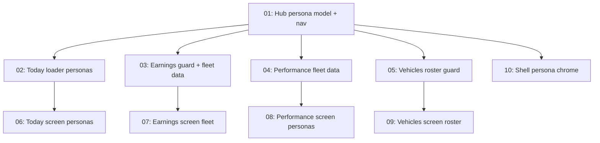

# Driver Hub Personas

## Overview

The Driver Hub serves three registered-driver account shapes — an independent driver, a driver employed on a company's roster, and a fleet-owning business — but only distinguishes the roster driver in two places in the whole codebase. Today, Earnings, My orders and Performance are byte-identical for all three, and their data types carry no account-shape field at all. This feature makes `HubPersona` (`"INDEPENDENT" | "ROSTER" | "BUSINESS"`) a first-class axis derived once in `resolveHubAccount()`, threads it through every loader and screen, hides the Wallet from roster drivers (in the nav *and* server-side), stops a roster driver registering a personal vehicle their employer cannot see, and gives business accounts real fleet rollups with per-driver breakdowns — all from data that already exists. No schema changes, no migrations.

## Quick Links

- [Requirements](./requirements.md) — full requirements, non-goals and acceptance criteria
- [Action Required](./action-required.md) — manual steps needing human action
- Source handoff: `UI:UX/Registered Driver account (New)/Driver dashboard header alignment/`
- Closest prior spec (conventions): [`specs/driver-load-board/`](../driver-load-board/)

## Dependency Graph

## Waves

| Wave | Tasks | Description |
|------|-------|-------------|
| 1 | task-01 | The persona spine — `HubPersona` on `HubAccount`, persona-keyed nav visibility replacing the `businessOnly`/`rosterHidden` booleans, Wallet hidden for roster drivers. Everything else depends on this. |
| 2 | task-02, task-03, task-04, task-05 | Server-side: persona on each loader's data type, the Earnings and Vehicles guards, and the business fleet rollups computed from real `Order`/`Vehicle` rows. Four disjoint file sets. |
| 3 | task-06, task-07, task-08, task-09, task-10 | Client-side: each screen renders its persona branches, fleet breakdown tables land, personal copy is reworded for fleet owners, and the shell hides persona-irrelevant chrome. Five disjoint component sets. |

## Task Status

### Wave 1
- [x] [task-01-hub-persona-model](./tasks/task-01-hub-persona-model.md) — Add `HubPersona` to `HubAccount` and re-key nav visibility on it

### Wave 2
- [x] [task-02-today-persona-data](./tasks/task-02-today-persona-data.md) — Persona on `HubTodayData`; fleet jobs-in-progress count and fleet-wide attention rows
- [x] [task-03-earnings-persona-data](./tasks/task-03-earnings-persona-data.md) — Roster redirect for `/dashboard/earnings`; per-driver revenue breakdown for business accounts
- [x] [task-04-performance-persona-data](./tasks/task-04-performance-persona-data.md) — Persona on `HubPerformanceData`; per-driver acceptance/completion for business accounts
- [x] [task-05-vehicles-roster-guard](./tasks/task-05-vehicles-roster-guard.md) — `403` a roster driver from `POST /api/driver-profile/vehicles`; expose `canAddVehicle`

### Wave 3
- [x] [task-06-today-screen-personas](./tasks/task-06-today-screen-personas.md) — Today screen renders the fleet count, fleet attention card and roster framing
- [ ] [task-07-earnings-screen-fleet](./tasks/task-07-earnings-screen-fleet.md) — Earnings screen renders the per-driver revenue table and fleet-appropriate tile copy
- [ ] [task-08-performance-screen-personas](./tasks/task-08-performance-screen-personas.md) — Performance screen renders the per-driver table and drops "your score" copy for fleets
- [ ] [task-09-vehicles-screen-roster](./tasks/task-09-vehicles-screen-roster.md) — Vehicles screen hides "Add vehicle" for roster drivers and labels the assigned vehicle
- [ ] [task-10-shell-persona-chrome](./tasks/task-10-shell-persona-chrome.md) — Sidebar hides the sampled incentive card off-persona; header chip reads the persona

---

> **Numbering note.** Task file numbers are stable identifiers, not an execution order — the Waves table above is authoritative for what runs when. A task added later keeps a high number even if it belongs in an early wave.
