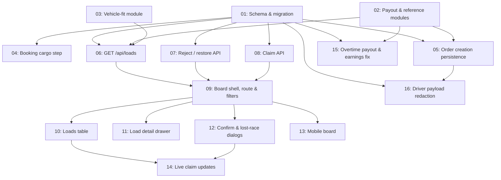

# Driver Load Board

## Overview

A dashboard where drivers see client bookings ("loads") and claim them
first-come, first-served. One screen at `/dashboard/loads` serves individual
drivers, sole proprietors and logistics companies, inside the existing driver hub
shell. Loads are filtered server-side to those the driver's vehicle can
physically carry; every money figure shown is the driver's 85% share, never the
client's price. Implements the high-fidelity design at
`UI:UX/Order Dashboard/design_handoff_driver_load_board/`, and supplies the two
pieces of data model that design assumes but the database does not yet have —
cargo weight/dimensions on `Order`, and a stored commission and driver payout.

## Quick Links

- [Requirements](./requirements.md) — full requirements, goals/non-goals, assumptions
- [Action Required](./action-required.md) — open decisions and manual steps
- Source handoff: `UI:UX/Order Dashboard/design_handoff_driver_load_board/README.md`
- Second handoff, folded into task-09: `UI:UX/Registered Driver account (New)/Driver dashboard header alignment/` — reshapes the driver hub header. Its notifications bell is deferred to its own spec (see Action Required).
- Prototype: `UI:UX/Order Dashboard/design_handoff_driver_load_board/Driver Load Board.dc.html`

## Dependency Graph

## Waves

| Wave | Tasks | Description |
|------|-------|-------------|
| 1 | task-01, task-02, task-03 | Schema and migration; the pure payout/reference and vehicle-fit modules everything else calls |
| 2 | task-04, task-05, task-06, task-07, task-08, task-15 | Capture cargo data at booking; the three board endpoints (list, reject, claim); settle the driver's overtime share and correct the Earnings screen |
| 3 | task-09, task-16 | The board route, hub nav entry, tabs, filter panel, state container and placeholder children; strip the client's gross fares out of every driver- and company-facing order payload |
| 4 | task-10, task-11, task-12, task-13 | The four visual surfaces: desktop table, detail drawer, dialogs, mobile |
| 5 | task-14 | Live claim updates without losing scroll position or selection |

## Task Status

### Wave 1
- [x] [task-01-schema-and-migration](./tasks/task-01-schema-and-migration.md) — Cargo fields, handling tags, load reference, commission columns, `LoadRejection`
- [x] [task-02-payout-and-reference](./tasks/task-02-payout-and-reference.md) — 15% commission maths and the `GE-` reference formatter
- [x] [task-03-vehicle-fit](./tasks/task-03-vehicle-fit.md) — Pure weight + L/W/H fit predicate and fleet capability aggregation

### Wave 2
- [x] [task-04-booking-cargo-step](./tasks/task-04-booking-cargo-step.md) — Weight, dimensions, packaging, quantity, handling tags, pickup window and deadline on the booking form
- [x] [task-05-create-order-persistence](./tasks/task-05-create-order-persistence.md) — Validate and persist the new fields, stamp reference, commission and payout
- [x] [task-06-loads-api](./tasks/task-06-loads-api.md) — `GET /api/loads`: fit filter, rejection exclusion, payout figures, contact redaction
- [x] [task-07-reject-api](./tasks/task-07-reject-api.md) — `POST` / `DELETE /api/loads/[id]/reject`, driver-scoped and reversible
- [x] [task-08-claim-api](./tasks/task-08-claim-api.md) — Atomic claim for drivers and companies, online gate, lost-the-race response
- [x] [task-15-overtime-and-earnings-payout](./tasks/task-15-overtime-and-earnings-payout.md) — Commission the overtime settled at completion; stop the Earnings screen showing drivers the client's total

### Wave 3
- [x] [task-09-board-shell](./tasks/task-09-board-shell.md) — Route, hub nav entry, header, tabs, filter panel, board state, placeholders
- [x] [task-16-driver-payload-redaction](./tasks/task-16-driver-payload-redaction.md) — Remove `price` and the itemised fare breakdown from every driver- and company-facing order response

### Wave 4
- [ ] [task-10-loads-table](./tasks/task-10-loads-table.md) — Seven-column sortable table, row states, empty state, footer
- [ ] [task-11-load-drawer](./tasks/task-11-load-drawer.md) — 400px detail drawer: header, route, cargo, actions
- [ ] [task-12-claim-dialogs](./tasks/task-12-claim-dialogs.md) — Confirm dialog and lost-the-race dialog
- [ ] [task-13-mobile-board](./tasks/task-13-mobile-board.md) — Mobile card list plus the detail bottom sheet the design omits

### Wave 5
- [ ] [task-14-live-updates](./tasks/task-14-live-updates.md) — Poll for status changes, update rows in place

> **Numbering note.** task-15 and task-16 were added after the initial pass, when
> the commission decision was extended to cover overtime and the review found the
> client's gross fares leaking into driver-facing payloads. They are Wave 2 and
> Wave 3 respectively, despite their numbers — the file numbers are stable
> identifiers, the Waves table above is authoritative for execution order.
