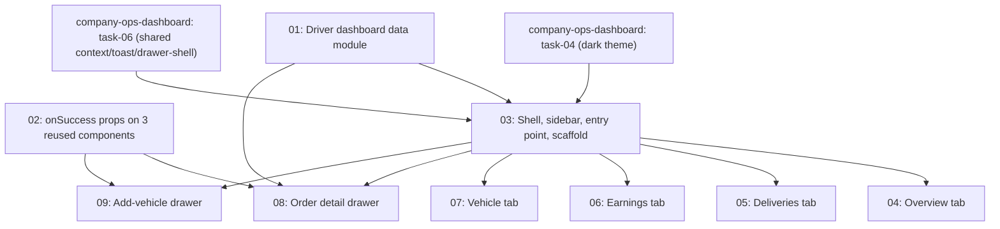

# Driver Ops Dashboard

## Overview

Replaces `src/components/dashboard/driver-dashboard.tsx` — currently a simple light-themed page listing a driver's own vehicles and bookings — with a tabbed, dark "ops console" dashboard (Overview / Deliveries / Earnings / Vehicle), matching the same visual design and component conventions as `specs/company-ops-dashboard/`. Renders at the same `/dashboard` route for role `DRIVER`; no other route changes. Unlike the company dashboard, no new backend routes are needed — every mutation already has a working route and component; this is almost entirely a UI restructuring task around one new data-aggregation module.

## ⚠️ Prerequisite — read before starting

**This spec depends on `specs/company-ops-dashboard` having already been implemented, at minimum through:**
- Its wave 1 task `task-04-dark-theme-foundation.md` (the `--ops-*` CSS tokens/keyframes/IBM Plex font in `globals.css`/`layout.tsx`).
- The **shared, role-agnostic** files created by its wave 2 task `task-06-shell-and-scaffold.md`: `src/components/dashboard/ops/ops-dashboard-context.tsx`, `src/components/dashboard/ops/ops-toast.tsx`, `src/components/dashboard/ops/ops-drawer-shell.tsx`. These three were written with no company-specific data baked in, specifically so this spec could import them directly instead of duplicating them.

Do not start this spec's Wave 1 until those files exist in the codebase. This spec's tasks import from those exact paths and do not recreate them.

## Quick Links

- [Requirements](./requirements.md) — full requirements and acceptance criteria
- [Action Required](./action-required.md) — manual steps needing human action
- Full original plan: `/Users/ketikenia/.claude/plans/polymorphic-cuddling-snail.md`
- Sibling spec this one depends on: `../company-ops-dashboard/`

## Dependency Graph

## Waves

| Wave | Tasks | Description |
|------|-------|-------------|
| 1 | task-01, task-02 | Foundations: the data-aggregation module, and an additive `onSuccess` prop on 3 existing driver-side mutation components. No file overlaps. |
| 2 | task-03 | Shell, sidebar, entry-point rewrite, and placeholder stubs for all 4 tabs + 2 drawers (same scaffold-then-fill technique as `company-ops-dashboard`'s task-06, so waves 3–4 can run fully parallel). |
| 3 | task-04, task-05, task-06, task-07 | Fill in real content for each of the 4 tab placeholders. Each task modifies only its own tab file. |
| 4 | task-08, task-09 | Fill in real content for each of the 2 drawer placeholders. Each task modifies only its own drawer file. |

## Task Status

### Wave 1
- [x] [task-01-driver-dashboard-data-module](./tasks/task-01-driver-dashboard-data-module.md) — `getDriverDashboardData` aggregation module
- [x] [task-02-mutation-onsuccess-props](./tasks/task-02-mutation-onsuccess-props.md) — optional `onSuccess` on `AcceptOrderButton`, `DeliveryLifecycleActions`, `VehicleForm`

### Wave 2
- [x] [task-03-shell-and-scaffold](./tasks/task-03-shell-and-scaffold.md) — driver dashboard shell, sidebar, entry-point rewrite, placeholders

### Wave 3
- [x] [task-04-overview-tab](./tasks/task-04-overview-tab.md) — status toggle, active-delivery card, stat tiles
- [x] [task-05-deliveries-tab](./tasks/task-05-deliveries-tab.md) — available + my deliveries, search/filter
- [x] [task-06-earnings-tab](./tasks/task-06-earnings-tab.md) — trend chart, KPIs
- [x] [task-07-vehicle-tab](./tasks/task-07-vehicle-tab.md) — own-vehicle cards, register/edit/remove

### Wave 4
- [ ] [task-08-order-detail-drawer](./tasks/task-08-order-detail-drawer.md) — accept/start/track/complete
- [ ] [task-09-add-vehicle-drawer](./tasks/task-09-add-vehicle-drawer.md) — wraps `VehicleForm`
