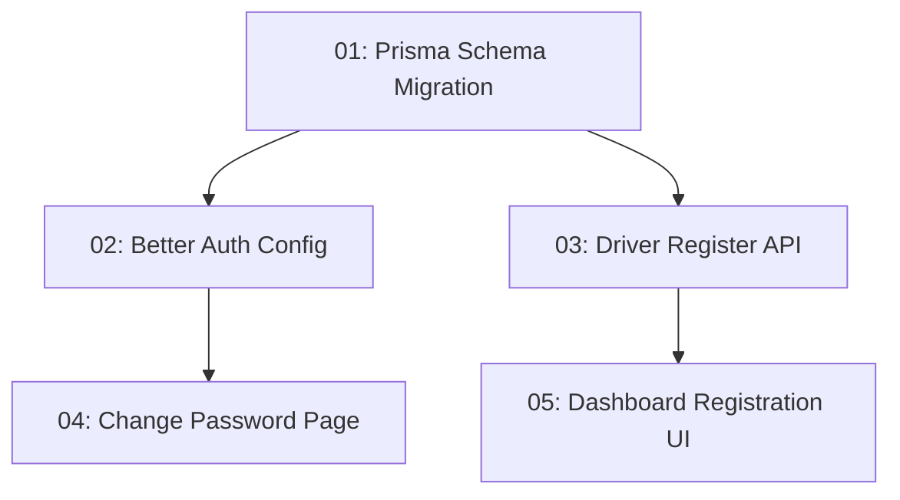

# Driver Registration and Vehicle Assignment

## Overview

Lets a logistics company admin register a brand-new driver account and assign them an existing fleet vehicle in one flow, directly from the company dashboard — replacing the requirement to send the driver to the public sign-up page and then link them by email afterward. The admin sets a temp password shown once on screen; the driver is forced to change it on first login.

**Updated 2026-08-07:** the old "link an independent driver by email" path (`CompanyDriverRoster`, `POST /api/logistics-company/drivers`) has been removed entirely, not kept alongside the new flow — see `requirements.md` for why. Task-05 has also been rewritten: it originally targeted `company-dashboard.tsx`'s old inline-expandable-section layout, which no longer exists — the company dashboard is now the tabbed dark `company-ops-dashboard` (see that sibling spec). Task-05 now targets a "+ Register driver" drawer on its Drivers tab instead.

## Quick Links

- [Requirements](./requirements.md) — full requirements and acceptance criteria
- [Action Required](./action-required.md) — manual steps needing human action

## Dependency Graph

## Waves

| Wave | Tasks | Description |
|------|-------|-------------|
| 1 | task-01 | Prisma schema: `User.mustChangePassword` + `DriverVehicleAssignment` model |
| 2 | task-02, task-03 | Better Auth wiring for the forced-password-change flag; the new driver-registration API endpoint |
| 3 | task-04, task-05 | Forced password-change page + dashboard enforcement; the company dashboard registration form |

## Task Status

### Wave 1
- [x] [task-01-schema-migration](./tasks/task-01-schema-migration.md) — Prisma schema migration for persistent assignment + forced password change

### Wave 2
- [x] [task-02-auth-config](./tasks/task-02-auth-config.md) — Expose `mustChangePassword` on the session and clear it on change
- [x] [task-03-driver-register-api](./tasks/task-03-driver-register-api.md) — `POST /api/logistics-company/drivers/register`

### Wave 3
- [x] [task-04-change-password-page](./tasks/task-04-change-password-page.md) — Forced password-change page + dashboard enforcement (built as one `src/app/change-password/page.tsx`, functionally equivalent to the task's page+form split)
- [x] [task-05-driver-register-ui](./tasks/task-05-driver-register-ui.md) — **Rewritten** to target the new company-ops-dashboard's Drivers tab (drawer-based) instead of the old inline-expandable-section dashboard
