# Driver & Vehicle Onboarding

## Overview

A self-serve onboarding wizard that takes an independent driver from account creation to an activated, dispatchable account: mobile/personal details, driving licence verification, vehicle registration, and a submit step, followed by an admin review queue that approves or flags each uploaded document before the driver can go online. Based on the approved design in `design_handoff_driver_onboarding/`. Replaces nothing — today an independent driver's `DriverProfile` is created with almost no data at sign-up and nothing gates it; this feature adds the missing licence/vehicle/document collection and the review gate before dispatch.

## Quick Links

- [Requirements](./requirements.md) — full requirements, decisions, and acceptance criteria
- [Action Required](./action-required.md) — manual steps needing human action

## Dependency Graph

```mermaid
graph TD
    task-01-schema["01: Schema Migration"]
    task-02-cities["02: Georgian Cities Mirror"]
    task-03-storage["03: Driver Document Storage"]

    task-04-classes["04: Vehicle Classes Constant"]
    task-05-draft-api["05: Onboarding Draft API"]
    task-06-docs-api["06: Onboarding Documents API"]
    task-07-activation["07: Activation Gate"]

    task-08-shell["08: Onboarding Wizard Shell"]

    task-09-step1["09: Step 1 — Auth & Personal"]
    task-10-step2["10: Step 2 — Licence"]
    task-11-step3ab["11: Step 3a/3b — Chassis & Class"]
    task-12-step3c["12: Step 3c — Technical Details"]
    task-13-step4["13: Step 4 — Review & Submit"]
    task-14-status["14: Application Status Screen"]

    task-15-admin-nav["15: Admin Nav Registration"]
    task-16-admin-read["16: Admin Read APIs"]
    task-17-admin-mutate["17: Admin Mutation APIs"]

    task-18-admin-queue["18: Admin Queue Page"]
    task-19-admin-drawer["19: Admin Detail Drawer"]

    task-20-redirect["20: Onboarding Redirect Wiring"]

    task-01-schema --> task-04-classes
    task-01-schema --> task-05-draft-api
    task-03-storage --> task-05-draft-api
    task-01-schema --> task-06-docs-api
    task-03-storage --> task-06-docs-api
    task-01-schema --> task-07-activation
    task-01-schema --> task-16-admin-read
    task-03-storage --> task-16-admin-read
    task-01-schema --> task-17-admin-mutate

    task-05-draft-api --> task-08-shell
    task-06-docs-api --> task-08-shell

    task-08-shell --> task-09-step1
    task-08-shell --> task-10-step2
    task-06-docs-api --> task-10-step2
    task-08-shell --> task-11-step3ab
    task-04-classes --> task-11-step3ab
    task-08-shell --> task-12-step3c
    task-04-classes --> task-12-step3c
    task-08-shell --> task-13-step4
    task-04-classes --> task-13-step4
    task-08-shell --> task-14-status
    task-06-docs-api --> task-14-status

    task-15-admin-nav --> task-18-admin-queue
    task-16-admin-read --> task-18-admin-queue
    task-15-admin-nav --> task-19-admin-drawer
    task-16-admin-read --> task-19-admin-drawer
    task-17-admin-mutate --> task-19-admin-drawer

    task-13-step4 --> task-20-redirect
    task-14-status --> task-20-redirect
    task-07-activation --> task-20-redirect
```

## Waves

| Wave | Tasks | Description |
|------|-------|--------------|
| 1 | task-01, task-02, task-03 | Schema migration (all new enums/models/fields), the Georgian-cities browser mirror, and the private document storage helper. No shared files. |
| 2 | task-04, task-05, task-06, task-07 | The class↔spec mapping constant, the draft save/resume API, the document upload API, and server-side activation-gate enforcement. All depend only on wave 1. |
| 3 | task-08 | The wizard's route, layout guard, step rail, progress bar, draft-state context, and per-step stubs — sized deliberately narrow so wave 4 can run fully parallel against it. |
| 4 | task-09 – task-14 | The six driver-facing screens (four wizard steps, one of which splits into two sub-steps, plus the status screen), each filling in one stub from task-08. |
| 5 | task-15, task-16, task-17 | Admin nav registration, the read APIs (list + detail), and the mutation APIs (approve/flag/request-changes) — independent of the driver wizard. |
| 6 | task-18, task-19 | The admin queue page and detail drawer, built against wave 5's APIs. |
| 7 | task-20 | Wires the `/dashboard` redirect that sends an eligible driver into the wizard, the status screen, or neither. |

## Task Status

### Wave 1
- [x] [task-01-schema-migration](./tasks/task-01-schema-migration.md) — All new enums/models/fields for onboarding, licences, applications, documents, activation
- [x] [task-02-georgian-cities-mirror](./tasks/task-02-georgian-cities-mirror.md) — Extend the browser-side city list mirror to the design's 63 cities with region
- [x] [task-03-driver-document-storage](./tasks/task-03-driver-document-storage.md) — Private Supabase bucket helper for identity/licence documents

### Wave 2
- [ ] [task-04-vehicle-classes-constant](./tasks/task-04-vehicle-classes-constant.md) — Design's 4 vehicle classes mapped onto existing `VehicleTypeSpec` codes
- [ ] [task-05-onboarding-draft-api](./tasks/task-05-onboarding-draft-api.md) — `GET`/`PATCH` resumable draft + `POST` reset
- [ ] [task-06-onboarding-documents-api](./tasks/task-06-onboarding-documents-api.md) — Signed upload URL + document recording
- [ ] [task-07-activation-gate](./tasks/task-07-activation-gate.md) — `DriverProfile.activatedAt` enforcement + backfill

### Wave 3
- [ ] [task-08-onboarding-shell](./tasks/task-08-onboarding-shell.md) — Route, layout guard, step rail, progress bar, draft context, step stubs

### Wave 4
- [ ] [task-09-onboarding-step1-auth-personal](./tasks/task-09-onboarding-step1-auth-personal.md) — Mobile, name, ID number, DOB, city, profile photo
- [ ] [task-10-onboarding-step2-licence](./tasks/task-10-onboarding-step2-licence.md) — Licence front/back upload, number, expiry, categories
- [ ] [task-11-onboarding-step3-chassis-class](./tasks/task-11-onboarding-step3-chassis-class.md) — Cargo body type + vehicle class, licence-category locking
- [ ] [task-12-onboarding-step3c-technical-details](./tasks/task-12-onboarding-step3c-technical-details.md) — Make/model, plate, colour, payload, cargo hold diagrams
- [ ] [task-13-onboarding-step4-review-submit](./tasks/task-13-onboarding-step4-review-submit.md) — Review summary + `POST submit` (server-authoritative validation)
- [ ] [task-14-onboarding-status-screen](./tasks/task-14-onboarding-status-screen.md) — Pending / action-required / approved states

### Wave 5
- [ ] [task-15-admin-nav-registration](./tasks/task-15-admin-nav-registration.md) — Register the new admin section
- [ ] [task-16-admin-applications-read-api](./tasks/task-16-admin-applications-read-api.md) — List + detail endpoints
- [ ] [task-17-admin-applications-mutation-api](./tasks/task-17-admin-applications-mutation-api.md) — Approve/flag/request-changes/approve-driver endpoints

### Wave 6
- [ ] [task-18-admin-applications-queue-page](./tasks/task-18-admin-applications-queue-page.md) — Filterable table
- [ ] [task-19-admin-applications-detail-drawer](./tasks/task-19-admin-applications-detail-drawer.md) — 520px detail drawer, per-document approve/flag

### Wave 7
- [ ] [task-20-onboarding-redirect-wiring](./tasks/task-20-onboarding-redirect-wiring.md) — Sends an eligible driver into the wizard/status screen from `/dashboard`
