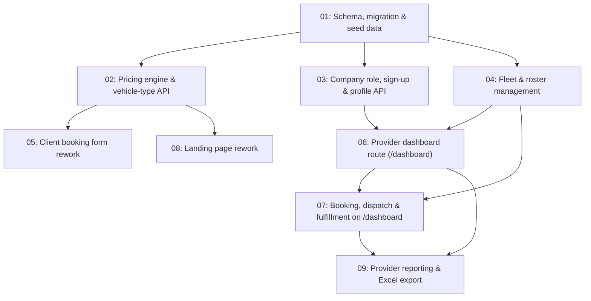

# Freight & Cargo Logistics Platform Pivot

## Overview

Pivots the app from a general small-parcel delivery platform into a commercial freight and cargo
logistics marketplace: medium-duty and heavy-duty vehicles only, a real base-fare/distance/time/
handling-fee pricing engine, and a new `LogisticsCompany` account type that runs its own vehicle
fleet and driver roster alongside today's independent drivers. This is a full replacement of the
existing `PackageType`/`VehicleType` model, not an additional tier.

## Quick Links

- [Requirements](./requirements.md) — full requirements and acceptance criteria
- [Action Required](./action-required.md) — manual steps needing human action

## Dependency Graph

## Waves

| Wave | Tasks | Description |
|------|-------|-------------|
| 1 | task-01 | Foundation: new Prisma schema, migration, seeded reference data (vehicle types + pricing rules), dev-data cleanup. Everything else depends on this. |
| 2 | task-02, task-03, task-04 | Pricing engine + public vehicle-type API; logistics-company role/sign-up/profile; fleet vehicle & driver-roster management APIs (company + reworked independent-driver vehicles). No file overlap between these three. |
| 3 | task-05, task-06, task-08 | Client booking form; the new `/dashboard` route for drivers and companies (identity, fleet, roster — `/account` now redirects providers there); landing page rework. No file overlap between these three. |
| 4 | task-07 | Booking, claim/dispatch, and delivery-lifecycle management, added to the `/dashboard` route Wave 3 built (`/orders` now redirects providers there too). Runs alone since it extends files Wave 3's task-06 created. |
| 5 | task-09 | Provider reporting (order history, earnings, fleet/driver utilization) and Excel export, appended to `/dashboard` on top of Wave 3/4's identity, fleet, and booking data. |

## Task Status

### Wave 1
- [x] [task-01-schema-and-seed](./tasks/task-01-schema-and-seed.md) — New Prisma schema, migration, and seed data

### Wave 2
- [x] [task-02-pricing-engine](./tasks/task-02-pricing-engine.md) — Pricing engine and public vehicle-type reference API
- [x] [task-03-company-account](./tasks/task-03-company-account.md) — Logistics company role, sign-up, and profile API
- [x] [task-04-fleet-vehicle-management](./tasks/task-04-fleet-vehicle-management.md) — Fleet vehicle & driver-roster management

### Wave 3
- [x] [task-05-client-booking](./tasks/task-05-client-booking.md) — Client booking form rework
- [x] [task-06-account-dashboards](./tasks/task-06-account-dashboards.md) — Provider dashboard route (`/dashboard`) for drivers and companies
- [x] [task-08-landing-page-rework](./tasks/task-08-landing-page-rework.md) — Landing page rework for freight positioning

### Wave 4
- [ ] [task-07-dispatch-and-fulfillment](./tasks/task-07-dispatch-and-fulfillment.md) — Order accept, claim, dispatch, and fulfillment on `/dashboard`

### Wave 5
- [ ] [task-09-provider-reporting](./tasks/task-09-provider-reporting.md) — Provider reporting, earnings & Excel export
