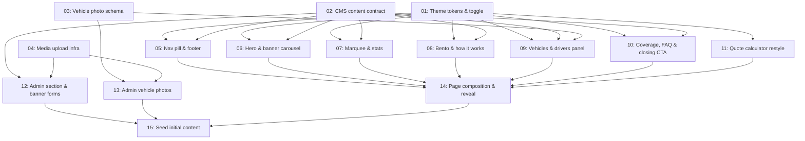

# Georgia Homepage Redesign

## Overview

Rebuilds the public marketing homepage to the high-fidelity `Home-Georgia-v3` design
handoff, with three requirements layered on top of the restyle: every banner and every
string on the page becomes editable from the admin back office at `admin.localhost:3000`;
the page gains a persisted, flash-free light/dark theme toggle (the app has no dark mode
today); and content managers get real Supabase-backed image upload instead of pasting
externally-hosted URLs. The handoff's courier-product copy is adapted to what this freight
platform actually does, the vehicle section is wired to the real `VehicleTypeSpec`
catalogue, and the working quote calculator is preserved in its own section below the hero.

## Quick Links

- [Requirements](./requirements.md) — full requirements, goals/non-goals, assumptions
- [Action Required](./action-required.md) — manual steps needing human action (Supabase
  bucket, brand name, photography, coverage figures)
- Design source of truth — `UI:UX/homepage/design_handoff_georgia_homepage/README.md`

## Dependency Graph

## Waves

| Wave | Tasks | Description |
|------|-------|-------------|
| 1 | task-01, task-02, task-03, task-04 | Foundation. The theme token set and toggle, the extended CMS section contract every renderer and admin form compiles against, the one Prisma migration, and the Supabase upload plumbing. Kept separate so nothing downstream edits `globals.css`, `home-page-content.ts` or `schema.prisma` concurrently. |
| 2 | task-05 … task-13 | The build-out. Seven landing sections (each owning its own component files) plus the two admin surfaces, all in parallel — no two tasks in this wave touch the same file. |
| 3 | task-14 | Composition. Rewrites `landing-page.tsx`, the exhaustive renderer switch, the page/route wiring and the scroll-reveal behaviour. Single-owner because it is the one file every wave-2 task feeds into. |
| 4 | task-15 | Seeds the CMS so the live page renders from the database rather than the TypeScript fallbacks. |

## Task Status

### Wave 1
- [ ] [task-01-theme-tokens-and-toggle](./tasks/task-01-theme-tokens-and-toggle.md) — Light/dark landing palette, persisted flash-free theme toggle
- [ ] [task-02-cms-content-contract](./tasks/task-02-cms-content-contract.md) — Extend the shared section contract with the new types and freight-adapted copy
- [ ] [task-03-vehicle-photo-schema](./tasks/task-03-vehicle-photo-schema.md) — `VehicleTypeSpec.imageUrl` migration and seed
- [ ] [task-04-media-upload-infra](./tasks/task-04-media-upload-infra.md) — Supabase `site-media` bucket helper, signed-upload route, reusable admin uploader

### Wave 2
- [ ] [task-05-nav-pill-and-footer](./tasks/task-05-nav-pill-and-footer.md) — Floating glass nav pill (hosting the theme toggle) and the four-column footer
- [ ] [task-06-hero-and-carousel](./tasks/task-06-hero-and-carousel.md) — Centred hero and the six-slide banner carousel
- [ ] [task-07-marquee-and-stats](./tasks/task-07-marquee-and-stats.md) — Partner logo marquee and the stats row
- [ ] [task-08-bento-and-how-it-works](./tasks/task-08-bento-and-how-it-works.md) — Bento feature grid and the numbered how-it-works list
- [ ] [task-09-vehicles-and-drivers](./tasks/task-09-vehicles-and-drivers.md) — Real vehicle catalogue with photos, and the For Drivers panel
- [ ] [task-10-coverage-faq-closing-cta](./tasks/task-10-coverage-faq-closing-cta.md) — City coverage list, FAQ accordion and closing CTA
- [ ] [task-11-quote-calculator-restyle](./tasks/task-11-quote-calculator-restyle.md) — Restyle the working quote calculator into its own section
- [ ] [task-12-admin-section-and-banner-forms](./tasks/task-12-admin-section-and-banner-forms.md) — Admin forms for every new section type, banner upload, 6-banner cap
- [ ] [task-13-admin-vehicle-photos](./tasks/task-13-admin-vehicle-photos.md) — Admin surface for setting a photo per vehicle type

### Wave 3
- [ ] [task-14-page-composition](./tasks/task-14-page-composition.md) — Compose the page, renderer switch, route wiring, scroll reveal

### Wave 4
- [ ] [task-15-seed-initial-content](./tasks/task-15-seed-initial-content.md) — Seed sections, banners and defaults so the CMS is the live source
