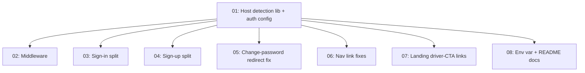

# Merchant/Client Host Split

## Overview

Separates the app's two audiences by hostname: a merchant subdomain serves DRIVER/COMPANY sign-in, sign-up, and the full ops dashboard, while the main domain continues to serve CLIENT sign-in, sign-up, and the booking/account experience — sessions fully isolated between the two. Built as a single Next.js app/deployment with host-based middleware, toggled off entirely (zero behavioral change) until `NEXT_PUBLIC_MERCHANT_HOST` is set, and fully testable today via `merchant.localhost:3000` with no real domain required.

## Quick Links

- [Requirements](./requirements.md) — full requirements and acceptance criteria
- [Action Required](./action-required.md) — manual steps needing human action
- Full approved plan: `/Users/ketikenia/.claude/plans/polymorphic-cuddling-snail.md`

## Dependency Graph

## Waves

| Wave | Tasks | Description |
|------|-------|-------------|
| 1 | task-01 | Foundation: `src/lib/host.ts` (host detection, tri-state env var, origin helpers) + `src/lib/auth.ts` (`trustedOrigins` extension, `hooks.before` sign-up role/host guard). Everything else depends on this. |
| 2 | task-02, task-03, task-04, task-05, task-06, task-07, task-08 | Parallel: middleware, the two split auth pages, the change-password redirect fix, nav link fixes, landing driver-CTA links, and env/README docs. No file overlaps between any of these seven. |

## Task Status

### Wave 1
- [x] [task-01-host-detection-and-auth-config](./tasks/task-01-host-detection-and-auth-config.md) — `src/lib/host.ts` + `src/lib/auth.ts` trustedOrigins/sign-up guard

### Wave 2
- [ ] [task-02-middleware](./tasks/task-02-middleware.md) — `src/middleware.ts` host gate
- [ ] [task-03-sign-in-split](./tasks/task-03-sign-in-split.md) — audience-aware `/sign-in`
- [ ] [task-04-sign-up-split](./tasks/task-04-sign-up-split.md) — audience-aware `/sign-up`
- [ ] [task-05-change-password-redirect](./tasks/task-05-change-password-redirect.md) — role-aware post-success redirect
- [ ] [task-06-nav-link-fixes](./tasks/task-06-nav-link-fixes.md) — `auth-status.tsx` + `layout.tsx` link fixes
- [ ] [task-07-landing-driver-links](./tasks/task-07-landing-driver-links.md) — driver-acquisition CTA links to the merchant host
- [ ] [task-08-env-and-docs](./tasks/task-08-env-and-docs.md) — `NEXT_PUBLIC_MERCHANT_HOST` in `.env`/`env.example`/`README.md`
